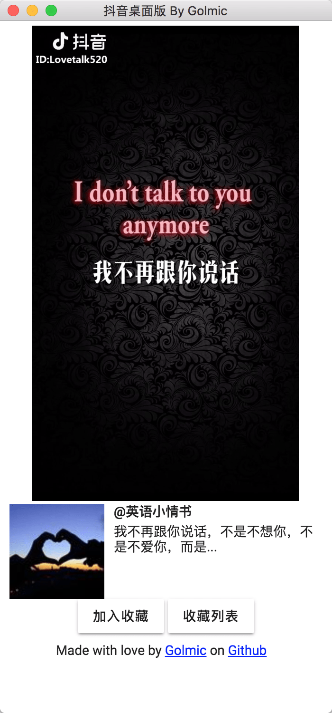
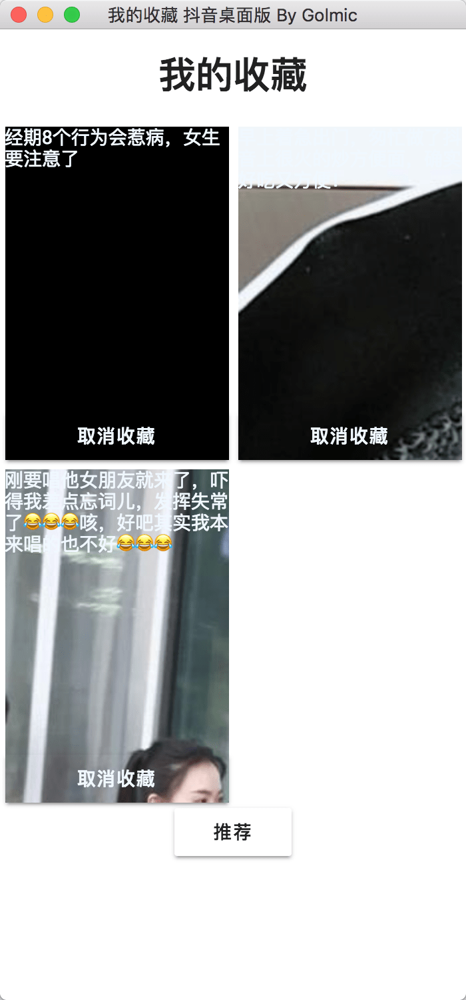

## 2018年7月9日 更新
由于原作者停止维护,接口地址变更为:[www.welltool.net](https://www.welltool.net/douyinweb),可以继续moyu了..

## 说明
稍作调整,方便自己用。。。

## -===== 以下为原作者说明 =====-
<h1 align="center">抖音 桌面版</h1>

## 停止维护

因各种原因，本项目不再维护、更新。
服务器将于2018年7月10日关闭。
十分感谢大家支持。

## 应用界面

## 下载

- Github Releases：
  [releases 页面](https://github.com/lujqme/douyin/releases)下载相应系统对应版本
- 服务器分发：[Windows](https://dl.lujianqiang.com/douyin_Setup_0.3.0.exe) | [mac OS](https://dl.lujianqiang.com/douyin-0.3.0.dmg)

## 使用

- 方向键 上：<kbd>↑</kbd> 上一个视频
- 方向键 下：<kbd>↓</kbd> 下一个视频
- 方向键 ← →：<kbd>←</kbd>, <kbd>→</kbd> 刷新
- 老板键 Alt + Q

## 声明

本应用使用今日头条官网 web 端公开的相应参数算法(见下)，未对抖音 APP 做逆向、分析、破解。

应用内的内容及视频版权归原作者以及抖音官方所有，本应用及其服务端不储存任何数据。

若本应用侵犯了您的权益，或造成不利影响，请联系 i@lujq.me，我将立即下架本应用。

## 源代码授权

遵循 MIT 授权

## 参数算法

具体 js 为：
https://s3.pstatp.com/toutiao/static/js/page/index_node/index.17e10acd0428d34edbef.js

算法为：

